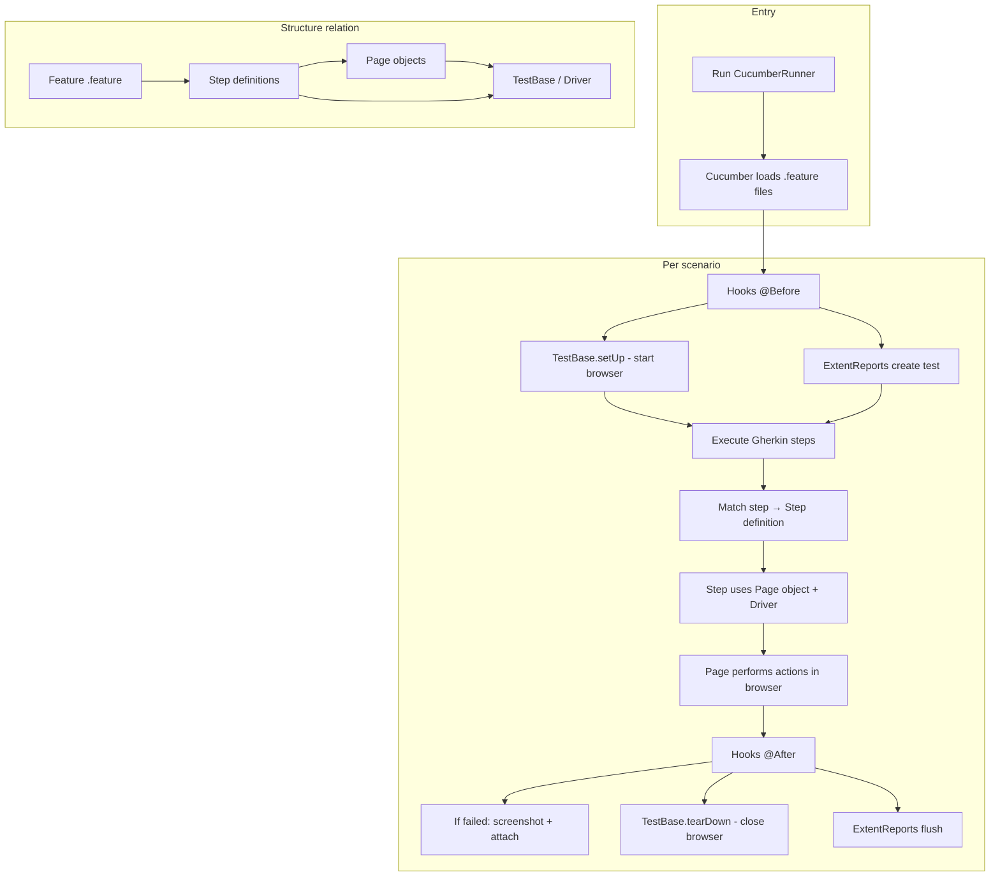

# QA Test Framework - Selenium-Template

## 1. What Is This Project?

This project is a **test automation template** for testing a web platform. It uses:

- **Selenium WebDriver** — to control a browser and interact with web pages
- **Cucumber (BDD)** — to write tests in plain language (Gherkin) and link them to code
- **Page Object Model (POM)** — to keep page structure and actions in one place
- **ExtentReports** — to generate HTML test reports and attach screenshots on failure

You can use this template as a starting point: add your own **features**, **pages**, and **step definitions** to test your application.

---

## 2. Project Structure

```
QAtest/
├── pom.xml                          # Maven: dependencies and build config
├── src/
│   ├── main/java/                   # Production / test-support code
│   │   ├── org/example/Main.java    # (unused placeholder)
│   │   └── pages/                   # Page Object classes
│   │       └── HomePage.java        # One page = one class (selectors + actions)
│   │
│   └── test/
│       ├── java/
│       │   ├── base/
│       │   │   └── TestBase.java    # Driver setup, wait, screenshots
│       │   ├── stepdefinitions/
│       │   │   ├── CucumberRunner.java  # Entry point: runs all .feature files
│       │   │   ├── Hooks.java          # Before/After: start driver, reports, screenshots
│       │   │   └── HomeSteps.java      # Maps Gherkin steps to page actions
│       │   └── ExtentReport/
│       │       └── ExtentManager.java  # HTML report configuration
│       │
│       └── resources/
│           ├── cucumber.properties  # Cucumber settings
│           └── features/            # Gherkin .feature files
│               └── home.feature     # Scenarios in plain language
│
└── target/                          # Generated after run: reports, screenshots
    ├── cucumber-reports/            # Cucumber HTML report
    ├── ExtentReport.html            # ExtentReports HTML
    └── screenshots/                # Screenshots on failed scenarios
```

---

## 3. How the Parts Work Together (Flow for Testing a Platform)

### 3.1 The chain: Feature → Steps → Page → Browser

| Layer | Role | Example in this project |
|-------|------|-------------------------|
| **Feature (.feature)** | Describes *what* to test in business language (Gherkin). | `home.feature`: “I open the application” → “the application page is displayed”. |
| **Step definitions** | Translate Gherkin sentences into *calls* to pages and assertions. | `HomeSteps.java`: “I open the application” → `getHomePage().openApplication()`. |
| **Page objects** | Know *where* elements are and *what* actions exist on a page. | `HomePage.java`: `openApplication()`, `isApplicationPageDisplayed()`. |
| **TestBase** | Provides the browser (driver), wait, and helpers (e.g. screenshots). | `TestBase.java`: `setUp()`, `tearDown()`, `captureScreenshot()`. |

So: **Feature** → **Step definitions** → **Page objects** → **TestBase (driver)** → **real browser**.

### 3.2 Lifecycle of one scenario

1. **Run** — You run `CucumberRunner` (e.g. via Maven or IDE).
2. **Cucumber** — Picks up all `.feature` files under `src/test/resources/features`.
3. **Before each scenario (Hooks)** — `Hooks.@Before`: starts driver (`TestBase.setUp()`), creates an ExtentReports test.
4. **Scenario execution** — For each step in the scenario, Cucumber finds the matching step in `HomeSteps` (or other step definition classes). Steps use **Page objects** and **TestBase.getDriver()** to perform actions and checks.
5. **After each scenario (Hooks)** — `Hooks.@After`: if the scenario failed, takes a screenshot and attaches it to the report; then closes the driver (`TestBase.tearDown()`) and flushes the report.

So: **Runner** → **Hooks (before)** → **Steps + Pages + Driver** → **Hooks (after)** → **Report + Screenshots**.

### 3.3 Relation between “structure” and “pages” for testing a platform

- **One “page” in your app** (e.g. Login, Home, Dashboard) → **one Page class** in `pages/` (e.g. `LoginPage.java`, `HomePage.java`).
- **One “flow” or “feature”** (e.g. login, checkout) → **one or more .feature files** and a **step definition class** that uses the relevant page classes.
- **TestBase** is shared: all steps get the same driver and wait from `TestBase.getDriver()` and `TestBase.getWait()`.

So the “structure” that tests a platform is: **Features (by flow)** + **Step definitions (by flow)** + **Pages (by screen)** + **TestBase (shared)**.

---

## 4. Quick Reference: Where to Add What

| You want to… | Do this… |
|--------------|----------|
| Add a new test scenario in plain language | Add or edit a `.feature` file in `src/test/resources/features/`. |
| Implement or reuse a Gherkin step | Add or edit a step definition class in `stepdefinitions/` (e.g. `LoginSteps.java`). |
| Model a new screen of the platform | Add a new class in `pages/` (e.g. `LoginPage.java`) with selectors and methods. |
| Change browser, timeouts, or screenshot behaviour | Edit `TestBase.java`. |
| Change report look or path | Edit `ExtentManager.java`. |
| Run all tests | Run the `CucumberRunner` JUnit test or use Maven: `mvn test`. |

---


## 5. Mermaid diagram (ready to paste)

You can paste this into any Markdown viewer or Mermaid-supported tool to see the flow:



---

*This documentation gives an overview of the project, its structure, how the layers relate when testing a platform, and a prompt plus Mermaid snippet for a visual flow.*
